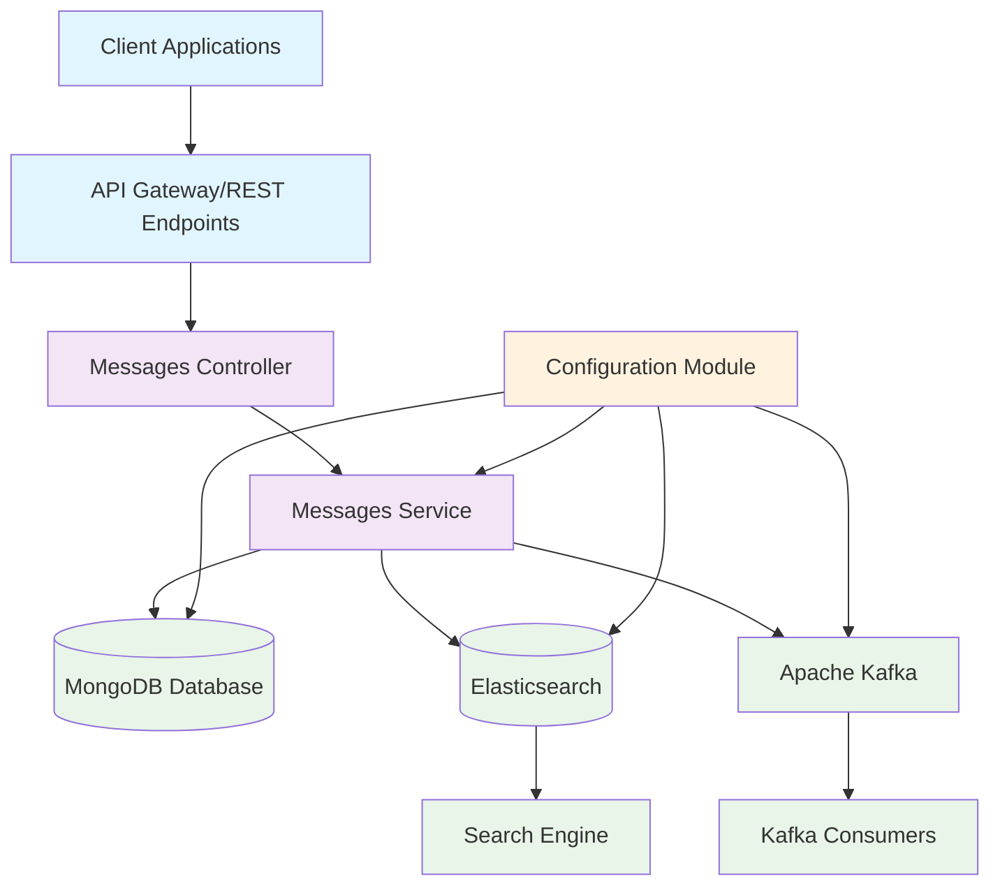
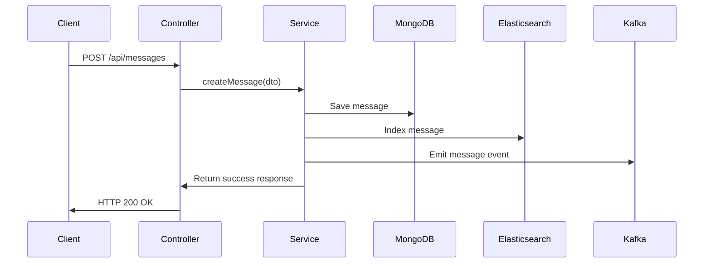
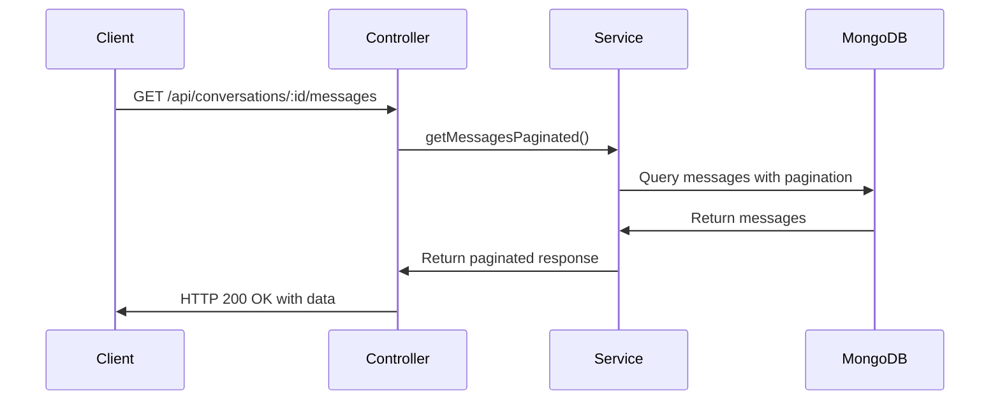
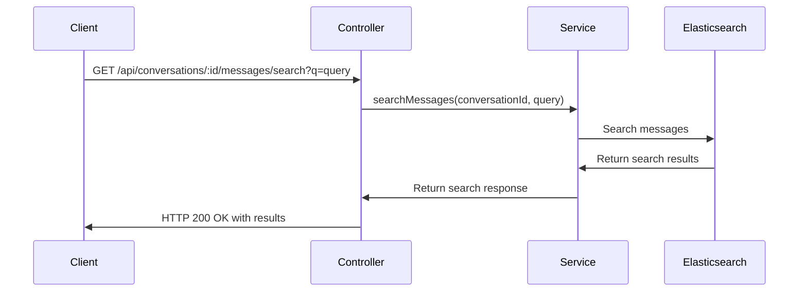

## How to install ?

1. Clone the repository
2. Run npm install
3. Configure Env [ Kafka, Elastic Search, DB_URL, Elastic Password, System Port ]
4. npm run start:dev
5. For APIs: Import collection to postman from root foler [ MessageApp.postman_collection.json ]

## System Architecture Diagram

## Data Flow

### Message Creation Flow

### Message Retrieval Flow

### Message Search Flow

## 🛠️ Tech Stack

- **NestJS**, **TypeScript** – Backend framework  
- **MongoDB**, **Mongoose** – Data storage  
- **Elasticsearch** – Full-text search  
- **Kafka**, **KafkaJS** – Real-time messaging  
- **@nestjs/config** – Env config

---

## 📦 Modules

- **AppModule** – Root config & imports  
- **MessagesModule** – APIs, logic, Mongo schema  
- **KafkaModule** – Kafka setup & messaging  
- **ElasticsearchModule** – Search/indexing  
- **DatabaseModule** – MongoDB connection

---

## 🔌 API Endpoints

- `POST /api/messages` – Create + store + index + publish  
- `GET /api/conversations/:id/messages` – Paginated fetch  
- `GET /api/conversations/:id/messages/search?q=` – Full-text search
